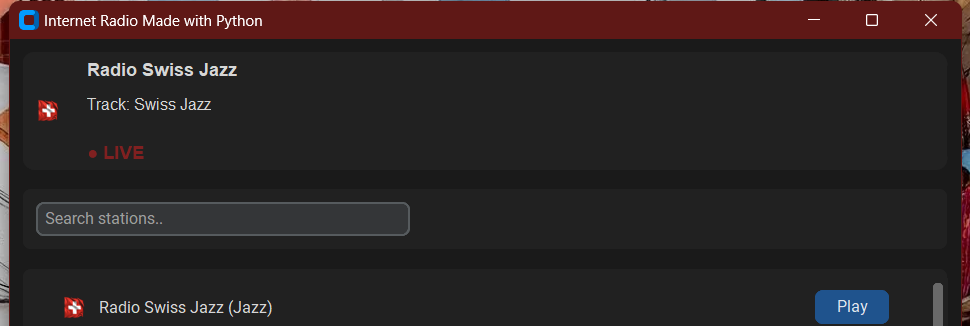
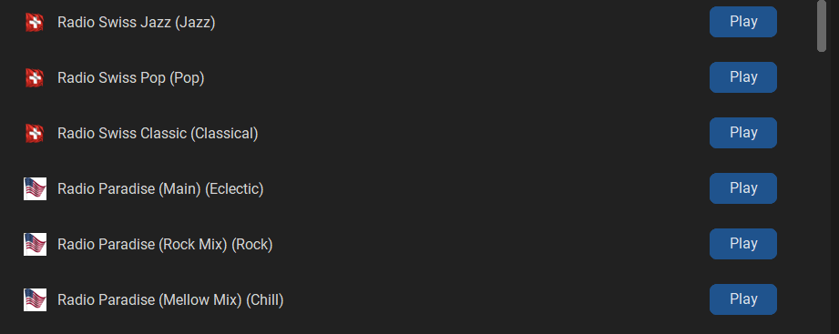
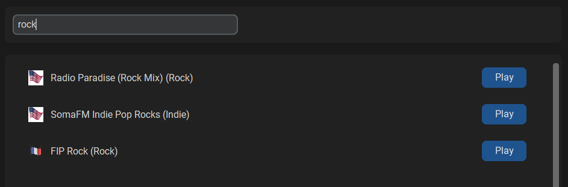

# Internet Radio (Python + CustomTkinter + VLC)

A modern, modular Internet Radio application built with **Python**, **CustomTkinter**, and **python-vlc**.  
It features a clean UI, live metadata updates, station search, flag icons, and a modular architecture that makes future expansion easy.

---

## 🚀 Features

- **Play hundreds of online radio stations**
- **Live metadata updates** (track titles, artist info, etc.)
- **Search bar** for instant station filtering
- **Country flags** for each station
- **Scrollable station list**
- **Now Playing card** with LIVE indicator
- **Volume control + Stop button**
- **Modular architecture** (easy to extend)
- **JSON‑based station database**

---

## 📸 Screenshots

Below are some example screenshots of the Internet Radio app in action.  
(You can add your own images to the `assets/screenshots/` folder and update the paths here.)

### 🖥️ Main Window


### 🎵 Now Playing Card


### 📜 Station List


### 🔍 Search Bar


---

## 🧩 Project Structure
internet_radio/ │ ├── app.py ├── requirements.txt │ ├── gui/ │   ├── main_window.py │   ├── now_playing.py │   ├── station_list.py │   ├── controls.py │   └── search_bar.py │ ├── player/ │   ├── radio_player.py │   └── stations.py │ └── assets/ └── icons/ ├── stop.png ├── flags..

---

## Installation

### Clone the repository

```bash
git clone https://github.com/reory/internet-radio-python.git
cd internet-radio-python


Install dependencies
pip install -r requirements.txt


Install VLC
This app uses python-vlc, which requires VLC installed on your system.
Download VLC here:
https://www.videolan.org/vlc/

Run the app
python app.py

Add Radio Stations which are stored in:
player/stations.json

Future Plans
- Interactive world map for selecting stations by country
- Favourites system
- Categories & filters
- Mini‑player mode
- Buffering indicator
- Better error handling for offline stream

License
MIT License — free to use, modify, and share.

Built by Roy Peters — a hands‑on architect exploring Python GUI development, 
modular design, and media streaming.


